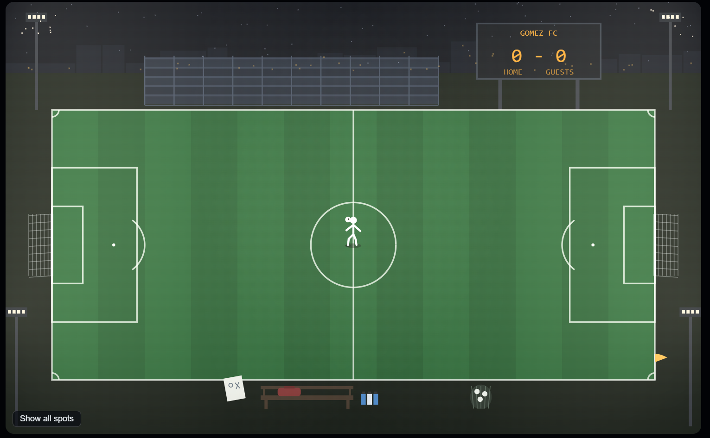
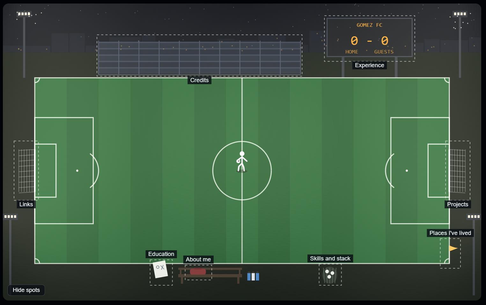
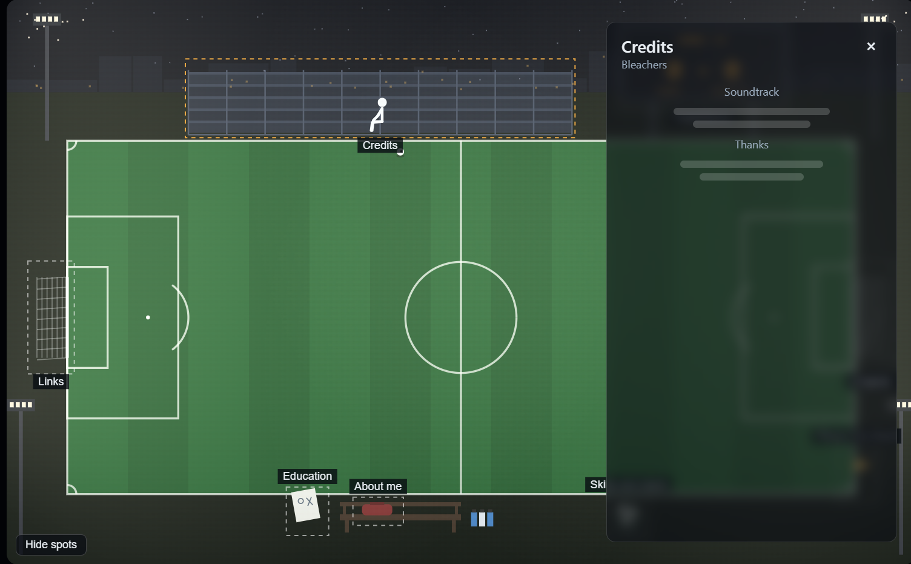

# Night Field Portfolio — Build Spec

This spec is for Claude Code. Build the site one stage at a time. After each stage, stop, summarize what you built, and wait for review before starting the next one.

Reference files that sit next to this spec in the repo:

- `reference/prototype.html` is a working canvas prototype of the scene. Open it in a browser. It is the source of truth for layout, spot placement, player routines, timing, and panel behavior. Port its behavior faithfully, but not its code structure.
- `reference/screenshots/` has screenshots of the prototype: the dark intro, the fully lit field, each of the eight panels open, and the "show all spots" view.

---

## 1. What we're building

This is a personal portfolio for Chris Gomez, a software engineer and the founder of Clavr. It goes to recruiters and hiring managers.

The whole site is a 2D night soccer field under floodlights. It loads in pitch black, the floodlight banks click on one at a time, and a lone player juggles at the center circle. The objects around the field are the navigation. When a visitor clicks one, the player jogs over and does something, and a frosted, semi-transparent panel opens with that section's content. The field stays visible and animated behind the panel.

The mood is chill, crisp, and quiet, like playing alone under the lights late at night. It is not a game, and nothing is gated behind a challenge.

Three hard requirements:

1. **It has to be sendable.** A recruiter must be able to get everything, fast. A plain `/press` page shows all the content without the scene.
2. **Everything is editable from a dashboard.** No bios, projects, photos, or dates are hard-coded. Chris edits content in Sanity Studio at `/studio`, and the live site updates within seconds with no redeploy.
3. **It costs $0 to run.** Use Vercel Hobby and Sanity Free only. Add no paid services, databases, or add-ons.

Below are screenshots to see the animation...

Example of what happens when you click bleachers

---

## 2. Stack and constraints

- **Framework:** Next.js (App Router, TypeScript), deployed on Vercel Hobby.
- **Content:** Sanity on the Free plan. Embed Sanity Studio in the Next app at `/studio` using `next-sanity`, and follow the current `next-sanity` docs for setup. Chris logs in with his Sanity account.
- **Data freshness:** Use tag-based revalidation. A Sanity webhook calls a Next route handler that runs `revalidateTag`. If webhooks aren't available on the plan, fall back to time-based revalidation (60 seconds). Pages are statically generated and served from cache, so visitor traffic barely touches Sanity's API quota.
- **Images:** Use the Sanity asset pipeline with `@sanity/image-url` for sized, cropped URLs, and `next/image` for rendering.
- **Scene rendering:** Use plain `<canvas>` 2D, the way the prototype does. Reach for PixiJS only if performance requires it.
- **Player animation:** In Stage 3, port the prototype's procedural stick figure first. Once it works, it can be swapped for a Rive state machine with illustrated art (see Stage 4). Keep the player behind one interface so the swap is local.
- **Sound:** Howler.js, muted by default, with a visible unmute toggle.
- **UI transitions:** CSS transitions are enough for the panel. Add GSAP only if needed.

**Free-tier rules:**

- The Sanity Free plan uses **public datasets**. Anything in Sanity is publicly readable, so never store private data there (no phone number, home address, or anything sensitive).
- The Free plan stops serving requests at its limits rather than billing, so there's no risk of a surprise bill. Still, cache aggressively and never fetch from Sanity client-side on every visit.
- Compress photos before upload. Asset storage has a cap.

---

## 3. Routes

| Route | Purpose |
|---|---|
| `/` | The night field scene. |
| `/press` | The "press box." A clean, fast, single-page version of every section, for recruiters, SEO, mobile fallback, and job applications. |
| `/studio` | Sanity Studio, the editing dashboard. Login required. |
| `/api/revalidate` | The webhook endpoint that Sanity calls on publish. Verify it with a secret. |

Every section in the scene must also be reachable on `/press`. The scene links to `/press` with a small, always-visible link.

---

## 4. Content model (Sanity schemas)

There are eight sections. Every field below is editable in Studio. Use `orderRank` (or a manual `order` number) wherever lists are ordered, so Chris can reorder items without code.

**`profile`** (singleton, used by About me)
- `name`, `headline` (short line under the name), `photo` (image with hotspot)
- `bio` (Portable Text)
- `email`, `location` (city-level only)
- `contactNote` (short text, e.g. "Best way to reach me")

**`project`** (list, used by Projects)
- `title`, `slug`, `blurb` (short), `description` (Portable Text)
- `images` (array of images), `role`, `stack` (array of strings)
- `links` (array of `{label, url}`), `featured` (boolean), `order`

**`experience`** (list, used by Experience)
- `company`, `role`, `startDate`, `endDate` (empty means present), `location`
- `summary` (Portable Text), `logo` (image, optional), `order`

**`education`** (list, used by Education)
- `school`, `degree`, `field`, `startDate`, `endDate`
- `honors` (short text), `publications` (array of `{title, venue, url}`), `order`

**`place`** (list, used by Places I've lived, shown as page-through cards)
- `city`, `region`, `years` (e.g. "2019–2023"), `photo`, `note` (1–3 sentences), `order`

**`links`** (singleton, used by Links)
- `github`, `linkedin`, `otherLinks` (array of `{label, url}`)
- `resume` (file upload, PDF). The "Download resume" button serves this file, so replacing the PDF in Studio updates the button.

**`skillGroup`** (list, used by Skills and stack)
- `label` (e.g. "Languages", "Infra", "ML"), `items` (array of strings), `order`

**`credits`** (singleton, used by Credits)
- `tracks` (array of `{title, artist, audioFile (optional), url (optional)}`)
- `thanks` (Portable Text)
- `builtWith` (short text)

**`siteSettings`** (singleton)
- `scoreboardName` (default "GOMEZ FC"), `seoTitle`, `seoDescription`, `ogImage`
- `ambientTrack` (audio file, optional)

Seed each type with one placeholder document so every panel renders during development.

---

## 5. Stage 1 — Plumbing, dashboard, and press box

**Goal:** At the end of this stage, Chris can log in at `/studio`, add a project with a photo, publish it, and see it on `/press` within seconds. The page can be plain, but it has to be sendable.

Tasks:

1. Scaffold the Next.js app (App Router, TS, ESLint). Add Sanity and embed Studio at `/studio`.
2. Implement every schema in Section 4, with Studio singletons for `profile`, `links`, `credits`, and `siteSettings`.
3. Write typed GROQ queries, one per section plus a combined query for `/press`. Generate types with Sanity TypeGen.
4. Build `/press` as a single, well-typeset page with sections in this order: About me (with contact), Projects, Experience, Education, Skills and stack, Places I've lived, Links (with the resume download), Credits. It should be fast, readable, and accessible, and work without JavaScript.
5. Add the revalidation route and webhook (see Section 2).
6. Build `/` as a placeholder that links to `/press` for now.
7. Deploy to Vercel. Document the env vars (`NEXT_PUBLIC_SANITY_PROJECT_ID`, `NEXT_PUBLIC_SANITY_DATASET`, `SANITY_REVALIDATE_SECRET`) in the README, and add the Vercel URL to Sanity's CORS origins.

Acceptance criteria:

- Editing any field in Studio and publishing updates `/press` in about 10 seconds or less, with no redeploy.
- Uploading a new resume PDF changes what the download button serves.
- Lighthouse scores for `/press` are 95 or higher on performance and accessibility.

---

## 6. Stage 2 — The static field, the floodlight intro, and eight spots

**Goal:** The scene exists and all eight spots open real content, but there is no player yet.

### Coordinate system

All scene layout lives in a fixed **900 × 560 design space**, the same as the prototype. The canvas scales to fit its container and stays sharp on high-DPI screens (multiply by `devicePixelRatio`). Hit-testing converts pointer coordinates back into design space.

### Scene layers (back to front)

1. Night sky with faint stars and a distant city skyline with a few warm lit windows (top strip, y 0–92).
2. Empty bleachers along the top touchline (x 180–560, y 70–134, five tiers).
3. Scoreboard on two posts (x 610–770, y 28–100). It reads `siteSettings.scoreboardName`, then "HOME score – 0 GUESTS". The home score increments each time the player scores during a session.
4. Four floodlight towers: two tall ones at the top corners and two at the far bottom sides.
5. The turf in alternating vertical stripes, with full pitch markings: boundary (x 60–840, y 140–490), halfway line, center circle, both penalty boxes and six-yard boxes, penalty spots and arcs, and corner arcs.
6. Two goals with nets at the left and right ends. The net ripples when the ball hits it.
7. Props along the bottom: the bench with a duffel bag on it, the tactics board propped beside the bench, water bottles at the other end of the bench, the mesh ball bag on the touchline, and the corner flag at the bottom-right corner.

### Floodlight intro

- The page loads pitch black. The towers switch on one at a time, about 0.7 seconds apart, and each one has a small overshoot flash as it comes on.
- The overall darkness overlay fades as more towers light up. Each lit tower adds a warm light cone.
- One bulb on the bottom-right tower flickers irregularly, forever.
- Moths drift around the lit heads of the two top towers.
- Scoreboard digits glow in proportion to how lit the field is.
- There is **no** "replay lights" button. The intro plays once per page load.

### The eight spots

| Spot | Section | Hit region (x, y, w, h) |
|---|---|---|
| Bag on the bench | About me (with contact) | 346, 496, 44, 22 |
| Right goal (home) | Projects | 836, 262, 40, 106 |
| Left goal (away) | Links | 24, 262, 40, 106 |
| Scoreboard | Experience | 608, 26, 164, 80 |
| Tactics board | Education | 280, 486, 36, 42 |
| Corner flag | Places I've lived | 826, 446, 32, 50 |
| Ball bag | Skills and stack | 598, 494, 36, 34 |
| Bleachers | Credits | 180, 62, 380, 72 |

- **Hover:** Draw a dashed outline around the object and show a small tooltip reading "Object · Section", e.g. "Corner flag · Places I've lived".
- **"Show all spots" button:** This is a small button in the bottom-left corner of the scene. It toggles dashed outlines and labels on all eight spots at once, so a confused visitor instantly knows what to click. Chris specifically wants to keep this.
- **Water bottles are not a spot.** They're scenery the player visits while idle (Stage 3).

### The panel

- The panel is frosted and semi-transparent (around `rgba(8,12,18,0.6)` with a light blur). It sits on the right side of the scene, and the field and animation stay visible behind it.
- It shows the section title and a subtitle naming the object, with a close button.
- Content comes from Sanity. The layouts are:
  - **About me:** photo, name, headline, bio, and the contact block.
  - **Projects:** a stack of project cards. Clicking one expands its detail inside the panel.
  - **Links:** GitHub, LinkedIn, other links, and a prominent "Download resume" button.
  - **Experience:** a reverse-chronological list.
  - **Education:** schools, degrees, honors, and publications.
  - **Places I've lived:** one card at a time with previous and next controls, plus a "1 / N" indicator.
  - **Skills and stack:** grouped chips.
  - **Credits:** soundtrack entries (playable if audio exists), then the thanks.
- Close the panel with the X button, the Escape key, or a click on empty field.
- Clicking a different spot while a panel is open switches directly to that spot.

Acceptance criteria:

- All eight spots open with real Sanity content.
- The layout matches the prototype's screenshots.
- The scene holds 60 fps on a mid-range laptop.

---

## 7. Stage 3 — The player

**Goal:** A lone player lives on the field and performs a routine at each spot.

### State model

The player runs a queue of steps: `move(to, speed, pose)`, `wait(duration, pose, onStart, onEnd)`, and `do(fn)`. The prototype's `run()` and `stepQ()` show the pattern.

Scene state flags: `bagOnBench`, `bagOnBack`, `boardHeld`, `ballInBag`, `homeScore`, and `ballMode` (juggle, foot, fly, rest, hidden).

Clicks are ignored while a routine is mid-flight (`busy`). The panel opens at the end of each "open" routine.

### Idle

- The player juggles at the center circle (450, 315). The ball bounces off his foot in rhythm.
- After a random 10–40 seconds idle, he dribbles to the water bottles, drinks for about 1.8 seconds, and returns to juggle. This is idle-only and not clickable.

### Routines

| Spot | Open routine | While open | Close routine |
|---|---|---|---|
| Bag on the bench | Dribbles to the bench, leaves the ball, crouches, picks up the bag | Stands wearing the bag on his back | Crouches and sets the bag back on the bench, then returns to center |
| Right goal (Projects) | Dribbles toward the goal, shoots low. Ball hits the net, the net ripples, the scoreboard ticks up and flashes. He celebrates with a jump and arms up | Stands | Jogs to retrieve the ball from the net, then returns |
| Left goal (Links) | A **different** finish: a zigzag dribble (four quick cuts) and then a **chipped** shot with a high arc. Same net ripple and score tick, then he celebrates | Stands | Retrieves the ball, then returns |
| Scoreboard (Experience) | Jogs under the scoreboard, leaves the ball | Hands on hips, looking up at the board | Returns to center |
| Tactics board (Education) | Jogs to the board, crouches, picks it up | Holds it in front of him, studying | Crouches and props it back, then returns |
| Corner flag (Places) | Places the ball on the corner arc, winds up, runs in, and crosses it into the box | Pointing to where the cross landed | Jogs to the ball, then returns |
| Ball bag (Skills) | Jogs to the ball bag, crouches, and drops the ball in (the ball visibly sits in the bag) | Stands beside the bag | Crouches and takes the ball back out, then returns |
| Bleachers (Credits) | Leaves the ball at the touchline, climbs the tiers | **Sits** on a bleacher tier and stays seated | Climbs down, picks up the ball, then returns |

When switching directly between spots, run the current spot's close routine, skip the return to center, and go straight into the new spot's open routine.

**Timing:** Match the prototype's pacing. A little faster on the return to center is fine, but don't rush the moments (shot, celebration, sitting down). Chris likes the current feel.

Acceptance criteria:

- Every routine matches the prototype's behavior.
- State flags stay consistent through any click order, including rapid switching and closing mid-panel.

---

## 8. Stage 4 — Polish

- **Sound (muted by default):** a thunk and hum for each tower as it switches on, soft ball-on-turf touches while juggling and dribbling, the net swish, a faint crowdless ambience, and Chris's own ambient track from `siteSettings.ambientTrack`. Show an unmute toggle near "Show all spots".
- **Illustrated art pass:** Replace the flat shapes with layered 2D illustration, keeping the same layout and coordinates. The player can move to a Rive state machine with inputs matching the poses (juggle, run, walk, shoot, celebrate, crouch, hips, study, wind, point, drink, sit) and a `hasBag` boolean.
- **Long shadows** from the four towers under the player and the ball.
- **Mobile:** Below about 700px wide, show the lit field as a hero with the "Show all spots" labels on, and open panels as bottom sheets. Offer a clear link to `/press`.
- **Reduced motion:** If `prefers-reduced-motion` is set, skip the intro and show an already-lit still frame. The player stands at center, and spots open panels with no routines.
- **Accessibility:** Spots are keyboard-focusable (an invisible button over each hit region, in tab order), panels trap focus and restore it on close, and every spot has an accessible label ("Projects: home goal").
- **SEO and sharing:** metadata and an OG image from `siteSettings`. `/press` is the canonical content page.

---

## 9. README

Keep `README.md` current as you go: add setup notes in Stage 1 and update it at the end of each stage. Do the final full pass at the end of Stage 4. It should cover, in this order:

1. **Title and one-line description**: Gomez Field, a personal portfolio as a 2D night soccer field.
2. **Screenshot**: leave a placeholder image link at `reference/screenshots/hero.png`. Chris will add the image.
3. **Overview**: what the site is, the floodlight intro, the eight spots and what each opens, and the `/press` page for recruiters. Keep it short.
4. **Stack**: Next.js, Sanity, Vercel, canvas, Howler, and the player animation approach, one line each.
5. **Running locally**: prerequisites (Node version), install, env vars (point to `.env.example`), and the dev command. Include how to open Studio at `/studio`.
6. **Editing content**: how to log into `/studio`, what each document type controls, and that changes go live in seconds with no redeploy.
7. **Deploying**: Vercel setup, env vars in the Vercel dashboard, the Sanity webhook to `/api/revalidate`, and CORS origins.
8. **Project structure**: a short tree of the main folders and what lives in each.
9. **Free-tier notes**: Sanity datasets are public, so keep private info out. Mention the Vercel Hobby and Sanity Free limits.

---

## 10. Git workflow

Every stage ships as its own pull request. Never commit directly to `main`.

At the **start** of a stage:

1. Confirm you're on `main` and up to date (`git checkout main && git pull`).
2. Create the branch: `stage-1-plumbing`, `stage-2-field`, `stage-3-player`, `stage-4-polish`.

**During** the stage:

3. Commit in small, working increments with clear messages. Prefer several focused commits over one giant one.
4. Never force-push and never rewrite history on a branch.

At the **end** of the stage:

5. Stop and tell Chris the stage is ready for review. Summarize what you built, what you'd flag, and how to test it locally.
6. Wait. Chris will test it and come back with fixes and refactors. Make those changes on the same branch, committing as you go.
7. Only when Chris says it's good: push the branch, then write a PR title and description. The description should have a short summary, a list of what changed, how to test it, anything deliberately left for a later stage, and any open questions. Open the PR if you have the tooling; otherwise print the title and body for Chris to paste.
8. Chris merges and returns to `main`. Do not start the next stage until he says so.

Never start the next stage's work on the current branch.

---

## 11. Rules for Claude Code

- Build one stage at a time. Stop at the end of each stage for review.
- Never hard-code personal content. If something needs text, it comes from Sanity or it's a placeholder seeded in Sanity.
- Don't add paid services, databases, auth providers, or analytics that cost money.
- Keep the scene code separate from the content code. The scene receives section data as props and renders it. Swapping the art or the player must not touch the data layer.
- When the prototype and this spec disagree, follow this spec, and mention the conflict in your stage summary.
